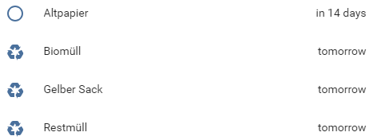

## reminder sensor 
This sensor is used to remind me of events that happen rarely, let's say like once a month.
Enter the dates and you'll be able to see the dates in home assistant as well as use them in automations and such.

### config
    sensor:
      - platform: garbage
        friendly_name: "Gelber Sack"
        dates: ['01.01.2010', '24.12.2020']
        icon: mdi:recycle
        format: days
        
| Attribute     | Required | Description |
| ------------- | -------- | ----------- |
| friendly_name | true     | friendly name of the sensor .. |
| dates         | true     | array of date-strings in `dd.mm.yyyy` format |
| icon          | false    | icon to show when active (mid:whatever) |
| format        | false    | days or normal: either shows `in x days` or `dd.mm.yyyy` if state is not `today` or `tomorrow` |

---

### example alerts/notifications
#### as automation
    automation:
      - alias: "Gelber Sack"
        initial_state: 'on'
        trigger:
          - entity_id: sensor.gelber_sack
            platform: state
            to: 'tomorrow'
        action:
          - service: notify.telegram_bot
            data:
              message: "Morgen Gelber Sack!"

#### as alert
    alert:
      gelber_sack:
        name: "Morgen Gelber Sack!"
        entity_id: sensor.gelber_sack
        state: 'tomorrow'
        repeat: 120
        can_acknowledge: True
        notifiers:
        - telegram_bot
